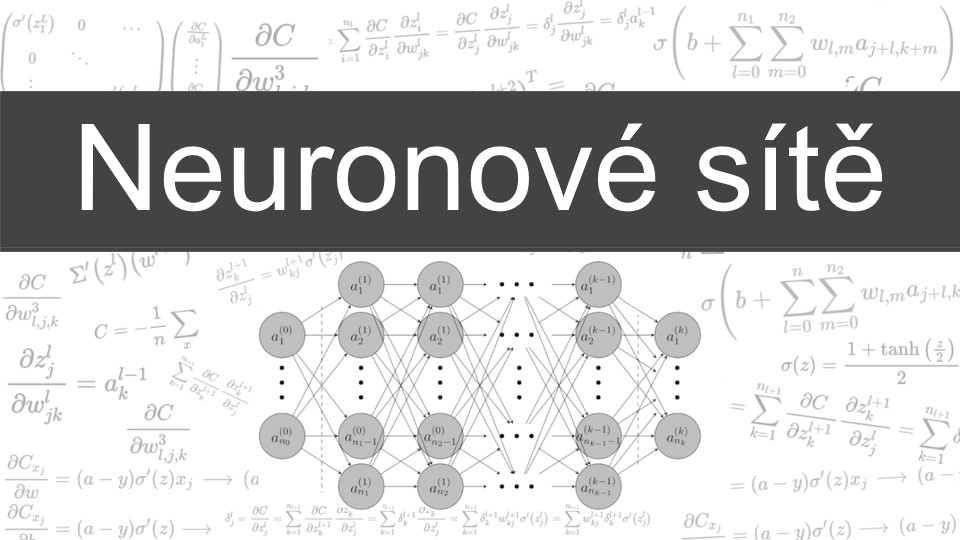

# Neural Networks and Deep Learning

This repository contains code and powerpoint presentations as used in the YouTube video series [link](https://www.youtube.com/playlist?list=PL2o3po04f3KZL0xq1PFjn3FUGl-uEiXEn) . Contains two directories:

## code
This directory holds progressively developed code in subdirectories named after the video it was developed in. Some comments and docstrings are added which were not written during the recording itself.

For the last video, I did not save my changes unfortunately except for the training of the models. You can easily follow the video to write the script for testing, but I was to lazy to write it myself.

# presentations
Contains PDF files with presentations used for the videos, again named by the video title. The presentations are in czech and possibly contain errors.
